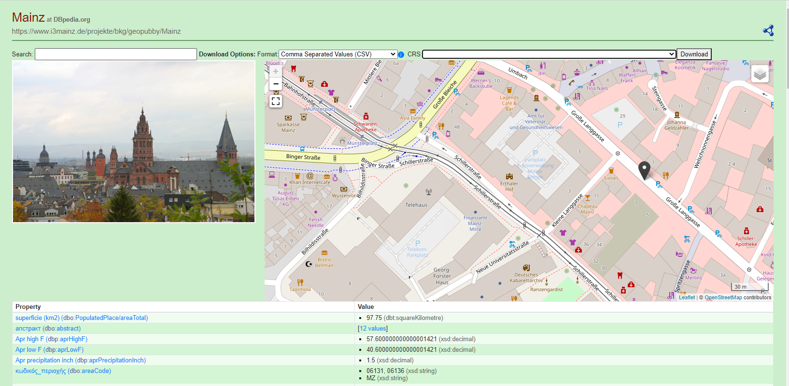

This is a Linked Data server that adds an HTML interface and
dereferenceable URLs on top of RDF data that sits in a SPARQL
store.

See [the Pubby website](http://www4.wiwiss.fu-berlin.de/pubby/)
for details and instructions.

## Features

In addition to Pubby, GeoPubby supports the following features:

* Detection of geometries in the following geometry literals:
  * GeoSPARQL WKTLiteral
  * GeoSPARQL GMLLiteral
  * GeoJSON Literal
  * Well-Known-Binary WKBLiteral
* Supports reprojection of geometries to [EPSG](http://www.epsg-registry.org) coordinate reference systems
* Implements a fuzzy search over concept labels 
* Implements the exports of geometries in one of the following formats:
  * RDF Serizalizations:  [HexTuples](https://github.com/ontola/hextuples), [JSON-LD](https://json-ld.org/spec/latest/json-ld/), [N-Triples](https://www.w3.org/TR/n-triples/), [Notation3](https://www.w3.org/TeamSubmission/n3/), [NQuads](https://www.w3.org/TR/n-quads/), [RDF/JSON](https://www.w3.org/TR/rdf-json/), [RDF/XML](https://www.w3.org/TR/rdf-syntax-grammar/), [TriG](https://www.w3.org/TR/trig/), [TriX](https://www.hpl.hp.com/techreports/2004/HPL-2004-56.html), [TTL](https://www.w3.org/TR/turtle/)
  * Vector geometry formats: [GeoHash](http://geohash.org), [GeoJSON](https://geojson.org/), [GeoJSON-LD](https://geojson.org/geojson-ld/), [GeoURI](https://geouri.org), [KML](https://www.ogc.org/standards/kml/), [GML](https://www.ogc.org/standards/gml), 
  [GPX](https://www.topografix.com/gpx.asp), LatLonText, [MapML](https://maps4html.org/MapML/spec/), [Open Location Code (OLC)](https://github.com/google/open-location-code/blob/master/docs/specification.md), [OSM/XML](https://wiki.openstreetmap.org/wiki/OSM_XML), [SVG](https://www.w3.org/Graphics/SVG/), [TopoJSON](https://github.com/topojson/topojson), [WKT](https://www.ogc.org/standards/sfa), [HexWKB](https://www.iso.org/standard/40114.html)
  * Coverage-centric formats:
     * [CoverageJSON](https://covjson.org) to display Points, LineStrings, Polygons and GridCoverages
     * [XYZASCII](https://gdal.org/drivers/raster/xyz.html) to display coverage data or simply a list of points
  * Multiple purpose formats: [CSV](https://tools.ietf.org/html/rfc4180), [JSON](https://www.json.org/json-en.html), [JSONP](http://jsonp.eu), [ODS](http://www.openoffice.org/sc/excelfileformat.pdf), [XLS](http://www.openoffice.org/sc/excelfileformat.pdf), [XLSX](http://www.openoffice.org/sc/excelfileformat.pdf), [YAML](https://yaml.org)
  * Binary formats: [BSON](http://bsonspec.org/), [RDF/EXI](https://www.w3.org/TR/exi/), [RDF/Thrift](https://afs.github.io/rdf-thrift/)
  * Streaming formats: [JSON Sequential](https://tools.ietf.org/html/rfc7464), [GeoJSON Sequential](https://github.com/geojson/geojson-text-sequences)

## Sample Screen

